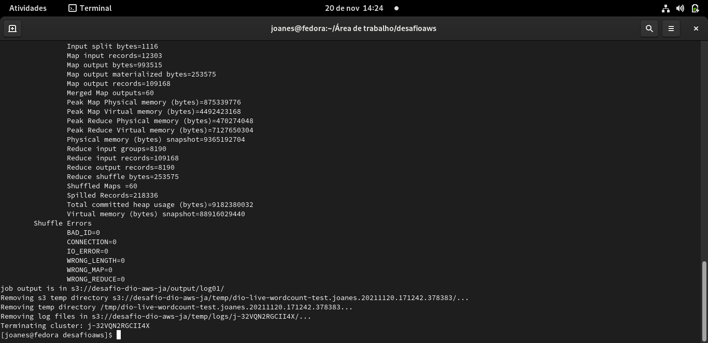

# Criando seu Ecossistema de Big Data na Nuvem


Código criado para utilização junto a plataforma da Digital Innovation One

<p align="center"></p>

**Aluno:** Joanes Cavalcanti de Araújo

**Prof:** Cassiano Peres
<br>
## Desafio 

Este repositório é relacionado ao desafio “Criando seu Ecossistema de Big Data na Nuvem”, promovido pela Digital Innovation One (DIO), penultimo curso do bootcamp: Cognizant Cloud Data Engineer.

---
## Objetivo

Implementar um cluster para o processamento distribuídode dados utilizando o serviço AWS EMR com Hadoop MapReduce para contar palavras em um arquivo de texto armazenado no AWS através de um algoritmo em Python.

### Entrega do Resultado

1. Criar um repositório no GitHub.
2. Inserir os arquivo ```data\sherlock.txt``` e ```logout\log01{resultados da consulta}``` no repositório e informar na plataforma da Digital Innovation One.

---
### Requisitos

1. Máquina virtual com o OS Fedora v.34.
2. Conta ativa na AWS.

---
### Imagens do processo

<p align="center"></p>
<p align="center"></p>
<p align="center"></p>
<p align="center"></p>
<p align="center"></p>
<p align="center"></p>

